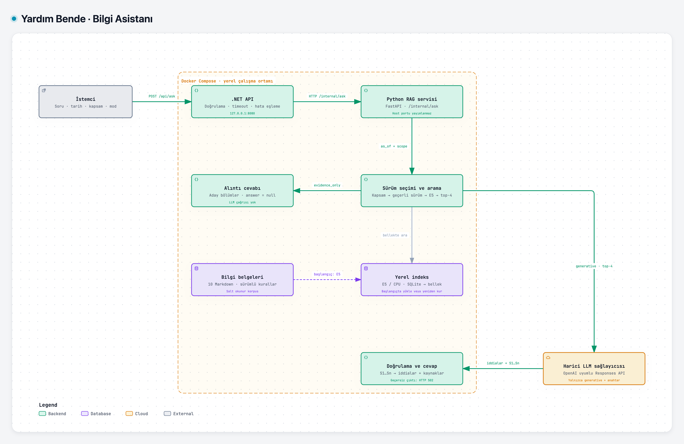

# AI destekli bilgi asistanı

Kurgu bir şirketin destek ekibi için, bilgi dokümanlarından yararlanarak Türkçe soruları yanıtlayan API. Ürün kullanımı, iade ve destek süreçleri hakkında 10 kısa doküman içerir; iade prosedürünün eski ve güncel sürümleri birlikte tutulur.

Yanıtlar kullanılan belgeyi, bölümü ve alıntıyı gösterir. Bilgi yetersizse bunu belirtir; eski sürümler tarih ve kapsam kontrolüyle arama öncesinde elenir.

## Çalıştırma

Docker Engine 25+ ve Docker Compose v2 gerekir. İlk açılışta embedding modeli indirilir (yaklaşık 490 MB); internet bağlantısı gereklidir.

```bash
git clone https://github.com/MertArtun/turkish-knowledge-assistant.git
cd turkish-knowledge-assistant
cp .env.example .env
```

`.env` dosyasında `OPENAI_API_KEY` alanına kendi OpenRouter anahtarınızı yazın. Örnek yapılandırma OpenRouter üzerinden `openai/gpt-6-luna` kullanır; anahtar repoya eklenmez. Ardından:

```bash
docker compose up --build -d --wait
curl -s http://127.0.0.1:8080/health/ready
curl -s http://127.0.0.1:8080/api/ask \
  -H 'Content-Type: application/json' \
  -d '{"question":"İade kargosunu kim ödüyor?","as_of":"2026-10-04","mode":"generative"}'
```

Bu soruda güncel iade prosedürü `D04` kullanılır; yanıt, onaylanan iade için şirketin sağladığı etiketle yapılan gönderimin bedelini şirketin karşıladığını belirtmelidir. `sources` kullanılan bölümü ve alıntıyı, `version_decisions` ise `D03` sürümünün neden dışlandığını gösterir. Gerçek yanıtlar [değerlendirme raporlarında](eval/results/20261005-000606-generative/report.md) bulunur.

- **Anahtarsız deneme:** Anahtarı boş bırakıp istekte `"mode":"evidence_only"` kullanın. Bu mod yalnızca aday bölümleri getirir; cevap üretmez (`answer=null`).
- **Varsayılan mod:** `.env` içindeki `APP_MODE=evidence_only`. Her istekte mod vermemek için bunu `generative` yapabilirsiniz; bu durumda anahtar zorunludur.
- **Tarihsel sorgu:** Örneğin `as_of=2026-06-01` eski iade prosedürünü seçer. Tarih verilmezse İstanbul'a göre bugün kullanılır; varsayılan kapsam `TR/B2B/MH-10`'dur.
- Üretken istekler ücretli model çağrısı yapar. Durdurmak için `docker compose down` kullanın.

Diğer istekler: [requests.http](examples/requests.http). Docker olmadan çalıştırma, yeniden indeksleme ve sorun giderme: [yerel geliştirme](docs/running.md).

## Nasıl çalışıyor?



.NET API istek doğrulamasını ve servis iletişimini yönetir. FastAPI geçerli belge sürümlerini seçer, yerel E5 embedding modeliyle ilgili bölümleri arar ve ilk dört bölümü LLM'e gönderir. Kaynak atıfları sunucuda doğrulanır. Belgeler Markdown dosyalarında, türetilen indeks SQLite'ta tutulur; arama bellekte yapılır.

| Cevap durumu | Anlamı |
|---|---|
| `answered` | Sorunun tamamı kaynak gösterilerek cevaplandı. |
| `partial` | Bir kısmı cevaplandı; eksik bilgi `missing_topics` alanında. |
| `insufficient_evidence` | Yeterli bilgi yok; nedeni cevapta belirtilir. |
| `evidence_only` | Yalnızca aday belge bölümleri getirildi. |

Sağlayıcı hatası veya geçersiz model çıktısı HTTP hatası olarak döner; bilgi eksikliği sayılmaz. [Teknik tercihler ve sınırlar](docs/decisions.md), [ayrıntılı API sözleşmesi](docs/project-spec.md).

## Değerlendirme

Normal, cevapsız ve çelişkili kaynak soruları içeren 18 soruluk ana set ve ayrıca 26 soruluk holdout seti kullanıldı. 20 geliştirme sorusu arama ayarları içindir. Her raporda beklenen sonuç, gerçek çıktı ve kontrol sonuçları yer alır.

| Set | Beklenen durumla eşleşen | Raporlar |
|---|---|---|
| Ana set, son iki koşu | 18/18 ve 18/18 | [Koşu 1](eval/results/20261005-000524-generative/report.md), [Koşu 2](eval/results/20261005-000606-generative/report.md) |
| Holdout, iki koşu | 23/26 ve 24/26 | [Koşu 1](eval/results/20261005-005747-generative-holdout/report.md), [Koşu 2](eval/results/20261005-005836-generative-holdout/report.md) |

Bu dört koşudaki **88 cevap insan tarafından da incelendi**; kararlar raporların son sütununda bulunur. Önceki koşuların insan incelemesi alanları `pending` olarak durur. Ana set geliştirme sırasında da kullanıldığından bağımsız başarı ölçümü değildir. Holdout hataları ve inceleme özeti [teknik notlarda](docs/decisions.md#değerlendirme-notları) açıklanır; ham çıktılar [eval/results](eval/results) altında saklanır.

Raporlardaki özgün commit kimliklerinin bu repodaki karşılıkları: [değerlendirme kayıtları](eval/README.md).

Stack çalışırken repo kökünden yeniden değerlendirme:

```bash
python3 eval/run_eval.py --mode generative
python3 eval/run_eval.py --mode generative --questions eval/holdout_questions.jsonl
```

Bu komutlar sırasıyla 18 ve 26 ücretli model çağrısı yapar. Anahtarsız arama kontrolü için `--mode evidence_only` kullanın.

## Testler ve sınırlar

Yerel testler için .NET SDK 10, uv ve Python 3.12 gerekir. Repo kökünden:

```bash
dotnet test
(cd src/rag_service && uv run pytest)
python3 -m unittest discover -s eval -p test_run_eval.py -q
```

Varsayılan testler sahte model ve HTTP yanıtları kullanır. Gerçek embedding ve canlı model kontrolleri için [test komutları](docs/running.md#testler).

Kaynak doğrulaması atfın geçerliliğini kontrol eder; cümlenin anlamsal doğruluğunu garanti etmez. Arama bazı ilgili bölümleri kaçırabilir. Tarih hesabı ve canlı müşteri sistemlerine erişim yoktur. Kimlik doğrulama ve yük testi bu örneğin kapsamı dışındadır.
